# Hello Servlet Project

このプロジェクトは、Java Servletを使って "Hello, World!" を表示するサンプルアプリケーションです。

**🚀 クイックスタート**

## 1. リポジトリをクローン

```
git clone https://github.com/your-username/hello-servlet.git
cd hello-servlet
```

## 2. 必要なツール

- Java 17以上

- Apache Maven


## 3. ビルドと実行

Mavenを使ってTomcat上でアプリケーションを起動します。

```
mvn clean install
mvn tomcat7:run
```

## 4. アクセスURL

アプリケーションホーム: http://localhost:8080/


プロジェクト構成
```
hello-servlet/
    ├── src
    │   └── main
    │       ├── java
    │       │   └── com/example/helloservlet
    │       │       └── HelloWorldServlet.java
    │       └── webapp
    │           ├── WEB-INF
    │           │   └── web.xml
    │           └── index.jsp
    └── pom.xml
```

---

仕組みについて

シーケンス図

```mermaid
sequenceDiagram

Browser ->> Tomcat: HTTP GET / (初期アクセス)
Tomcat ->> index.jsp: index.jsp をロード
index.jsp -->> Browser: HTMLコンテンツを表示（Hello Servlet Application & "Say Hello"リンク）
Browser ->> Tomcat: HTTP GET /hello （リンクをクリック）
Tomcat ->> web.xml: URLパターンを確認 → HelloWorldServletに委譲
web.xml ->> HelloWorldServlet.java: doGet()メソッドを呼び出し
HelloWorldServlet.java -->> Tomcat: "Hello, World!"のHTMLを生成
Tomcat ->> Browser: HTTPレスポンスで"Hello, World!"を表示
```


