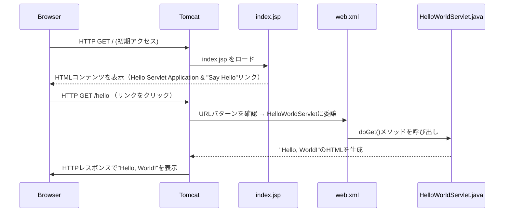

# Hello Servlet Project

このプロジェクトは、Java Servletを使って "Hello, World!" を表示するサンプルアプリケーションです。

## クイックスタート

## 1. リポジトリをクローン

```zsh
git clone https://github.com/your-username/hello-servlet.git
cd hello-servlet
```

## 2. 必要なツール

- Java 17以上

- Apache Maven

## 3. ビルドと実行

Mavenを使ってTomcat上でアプリケーションを起動します。

```zsh
mvn clean install
mvn tomcat7:run
```

## 4. アクセスURL

アプリケーションホーム: <http://localhost:8080/>

プロジェクト構成

```zsh
hello-servlet/
    ├── src
    │   └── main
    │       ├── java
    │       │   └── com/example/helloservlet
    │       │       └── HelloWorldServlet.java
    │       └── webapp
    │           ├── WEB-INF
    │           │   └── web.xml
    │           └── index.jsp
    └── pom.xml
```

---

### **Tomcatの設定と動作のまとめ**

1. **Tomcatの起動**  
   - `pom.xml` の `tomcat7-maven-plugin` により、`mvn tomcat7:run` で組み込みTomcatが起動。  
   - デフォルトで **ポート8080** でリクエストを待機。

2. **URLマッピング**  
   - `web.xml` で **URLパターン** と **Servletクラス** を関連付け。  
   - 例：`/hello` → `HelloWorldServlet` の `doGet()` が呼び出される。

3. **リクエスト処理フロー**  
   - ブラウザが `http://localhost:8080/hello` にアクセス。  
   - Tomcatがリクエストを受けて `web.xml` を参照。  
   - `HelloWorldServlet` がHTTPレスポンスで **`Hello, World!`** を返送。

4. **Tomcatの設定管理**  
   - **Mavenリポジトリ**内の組み込みTomcatが内部で `server.xml` や `web.xml` を使用して管理。  
   - **コンテキストルート:** `/`、**HTTPポート:** `8080`（デフォルト）。  

**結論:**  
Tomcatは **Mavenのプラグイン** と **Servlet API** により、Javaアプリケーションを **HTTPサーバーとして機能させる** 仕組みを提供しています。

シーケンス図


