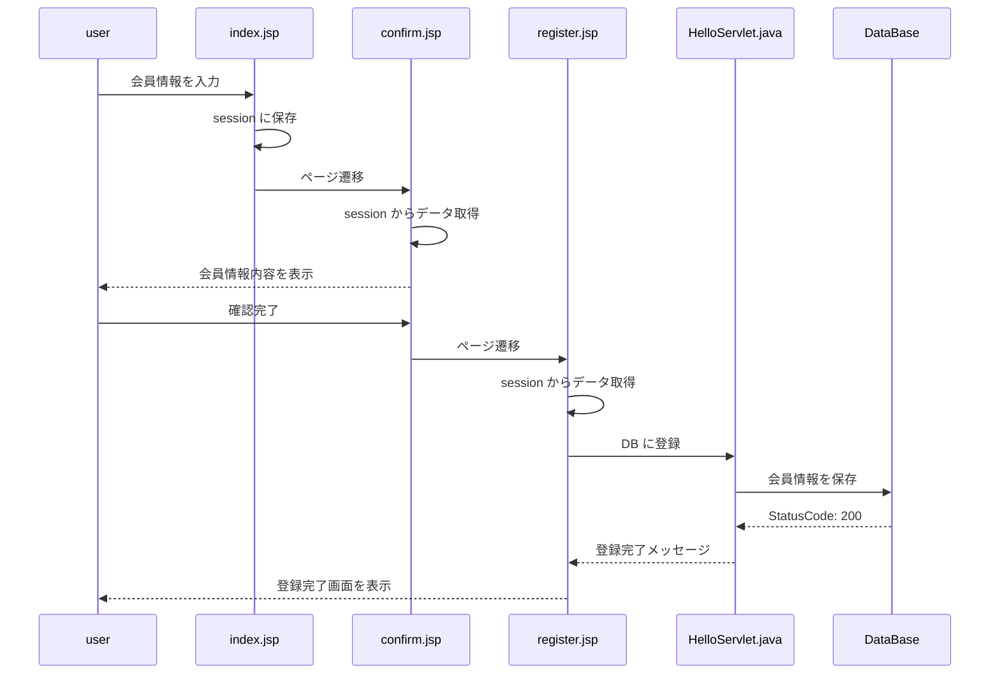

# 会員登録

## DB設計

```mysql
CREATE TABLE userlist(
    useruid varchar(36) NOT NULL primary key,
    username varchar(256) NOT NULL,
    email varchar(256) NOT NULL,
    password varchar(256) NOT NULL
);
```


